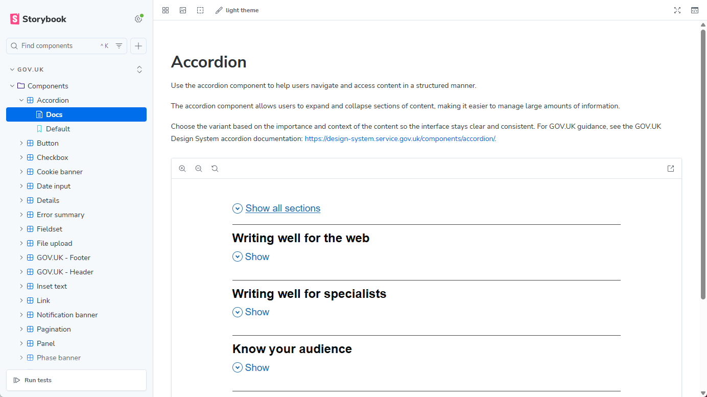

# GOV.UK Chakra

🚧 Work in Progress 🚧

     [](https://gov-uk-gds-react-chakra.vercel.app/)

`govuk-chakra` is a React component library that applies a [GOV.UK](https://design-system.service.gov.uk/get-started)-style skin on top of [Chakra UI](https://www.chakra-ui.com).
It is not a replacement for Chakra. The point is to keep Chakra's composability, theme system, and React ergonomics, while shipping a set of opinionated components and tokens that feel closer to the GOV.UK Design System.

Current Chakra version being used is: **3.34.0**.



## Links

- [**Live Demo**](https://gov-uk-gds-react-chakra.vercel.app 'Live demo')
- [**The npm page**](https://www.npmjs.com/package/govuk-chakra)
- [**GOV.UK Design System Figma File in Community**](https://www.figma.com/community/file/1550623138170727031/gov-uk-design-system-2025)
- [**Chakra-UI Library**](https://www.chakra-ui.com/docs/components/concepts/overview)
- [**GOV.UK Design System**](https://design-system.service.gov.uk/get-started)

## What This Project Is

- A Chakra-based design skin for React applications,
- A set of GOV.UK-flavoured components such as `GOVUKHeader`, `GOVUKFooter`, `CookieBanner`, `TaskList`, `SummaryList`, and form primitives
- A reusable Chakra system theme exported as `govUKTheme`
- A package that can be published to a package registry and consumed as a library instead of only being run as a local app

## What This Project Is Not

- An official GOV.UK Design System package
- A drop-in clone of `govuk-frontend`
- A full application framework
- A replacement for the GOV.UK Prototype Kit

## Why Build It This Way

The design choice here is deliberate:

- Chakra already solves a lot of React UI plumbing well: composition, theming, tokens, accessibility primitives, and styling ergonomics.
- GOV.UK has a strong visual language and interaction baseline that many public sector products want.
- Combining both gives you a React-first developer experience without forcing teams back into Nunjucks macros or prototype-first workflows.

## Installation

```bash
yarn add govuk-chakra @emotion/react @emotion/styled framer-motion react react-dom
```

`govuk-chakra` bundles Chakra UI, so consuming apps do not need to install `@chakra-ui/react` separately.

### Optional peer dependencies

Chart, code block, and rich text editor components are **not included in the main entry point**. They live in separate entry points so your app only pays the cost of the deps it actually uses.

| Entry point           | Install                                                                                                    | Components                                                                                                                                  |
| --------------------- | ---------------------------------------------------------------------------------------------------------- | ------------------------------------------------------------------------------------------------------------------------------------------- |
| `govuk-chakra/charts` | `yarn add @chakra-ui/charts recharts`                                                                      | `AreaChart`, `BarChart`, `BarList`, `BarSegment`, `Chart`, `DonutChart`, `LineChart`, `PieChart`, `RadarChart`, `ScatterChart`, `Sparkline` |
| `govuk-chakra/editor` | `yarn add shiki @tiptap/core@^3.21.0 @tiptap/pm@^3.21.0 @tiptap/react@^3.21.0 @tiptap/starter-kit@^3.21.0` | `CodeBlock`, `RichTextEditor`                                                                                                               |

```bash
# Charts
yarn add @chakra-ui/charts recharts

# Code block + Rich text editor
yarn add shiki @tiptap/core@^3.21.0 @tiptap/pm@^3.21.0 @tiptap/react@^3.21.0 @tiptap/starter-kit@^3.21.0
```

## Usage

For app setup, prefer the lightweight provider and theme entry points.

Wrap your app with the exported provider:

```tsx
import { GOVUKProvider } from 'govuk-chakra/provider'

export function AppRoot() {
  return (
    <GOVUKProvider>
      <App />
    </GOVUKProvider>
  )
}
```

## Next.js App Router

Create a client-side provider file:

```tsx
'use client'

import type { ReactNode } from 'react'
import { GOVUKProvider } from 'govuk-chakra/provider'

type ProvidersProps = {
  children: ReactNode
}

export function Providers({ children }: ProvidersProps) {
  return <GOVUKProvider>{children}</GOVUKProvider>
}
```

Then use it in your root layout:

```tsx
import type { ReactNode } from 'react'
import { Providers } from '@/providers/Providers'

export default function RootLayout({ children }: { children: ReactNode }) {
  return (
    <html lang="en">
      <body>
        <Providers>{children}</Providers>
      </body>
    </html>
  )
}
```

If you want direct access to the theme in Next.js, import it from `govuk-chakra/theme` instead of the package root.

## How Exports Work

This library exposes a single import surface.

It re-exports:

- all Chakra UI components
- then the local GOV.UK-styled wrapper components with the same names

That means wrapped local components take precedence over the Chakra originals for those names.

Example:

```tsx
import { Box, Stack, Heading, Button, Table } from 'govuk-chakra'
```

In that import:

- `Box` and `Stack` come from Chakra UI
- `Heading`, `Button`, and `Table` come from this library's local GOV.UK-styled wrappers

## Importing Components

Import everything from the main package entry:

```tsx
import {
  Box,
  Stack,
  Heading,
  Text,
  Button,
  Link,
  Table,
  GOVUKHeader,
  GOVUKFooter,
  Textinput,
  Separator,
} from 'govuk-chakra'
```

This is the intended usage model:

- use Chakra primitives directly from `govuk-chakra`
- use GOV.UK-wrapped components from the same import
- let the library decide which names are overridden locally

If a component has a local wrapper, the local wrapper is what consumers receive.

If a component does not have a local wrapper, the Chakra UI export is used as-is.

## Example

```tsx
import { Box, Heading, Button, Text, GOVUKHeader } from 'govuk-chakra'

export function ExamplePage() {
  return (
    <Box>
      <GOVUKHeader />
      <Heading size={48}>Service title</Heading>
      <Text fontSize={19}>
        This page uses Chakra layout primitives and GOV.UK-styled wrappers from the same package.
      </Text>
      <Button>Continue</Button>
    </Box>
  )
}
```

## Entry Points

- `govuk-chakra`
  Single combined barrel with Chakra UI exports plus local GOV.UK-styled overrides.
  Does **not** include charts, `CodeBlock`, or `RichTextEditor` — use the dedicated entry points for those.

- `govuk-chakra/charts`
  All chart components. Requires `@chakra-ui/charts` and `recharts` to be installed.

- `govuk-chakra/editor`
  `CodeBlock` (requires `shiki`) and `RichTextEditor` (requires `@tiptap/*`) components, plus `shikiAdapter` and `createGovUkShikiAdapter` helpers.

- `govuk-chakra/utils`
  Standalone utilities: `pxToRem`, `colorContrast`, `fieldFocusStyles`, and icon helpers. No extra deps required.

- `govuk-chakra/chakra`
  Chakra UI passthrough plus the shared GOV.UK provider and theme exports

- `govuk-chakra/theme`
  Lightweight theme-only entry for `govUKTheme`

- `govuk-chakra/provider`
  Lightweight provider entry for `GOVUKProvider`

```tsx
// Core components — no heavy deps needed
import { Button, GOVUKHeader, Heading } from 'govuk-chakra'

// Utilities — no extra deps
import { pxToRem } from 'govuk-chakra/utils'

// Charts — requires @chakra-ui/charts recharts
import { BarChart, LineChart } from 'govuk-chakra/charts'

// Code block + rich text — requires shiki and @tiptap/*
import { CodeBlock, RichTextEditor } from 'govuk-chakra/editor'
```

## Theme

If you want direct access to the Chakra system rather than the convenience provider:

```tsx
import { ChakraProvider } from '@chakra-ui/react'
import { govUKTheme } from 'govuk-chakra/theme'

export function AppRoot() {
  return (
    <ChakraProvider value={govUKTheme}>
      <App />
    </ChakraProvider>
  )
}
```

## Storybook Accessibility Tests

Storybook accessibility checks run as part of the existing browser-based Storybook Vitest project:

```bash
yarn test:storybook
```

By default, every story is expected to pass Storybook's built-in accessibility checks and failures will fail the test run.

Use `parameters.a11y` on a story or story meta only when you need an intentional exception:

```tsx
parameters: {
  a11y: {
    disable: true,
  },
}
```

Keep opt-outs rare and document why they are needed inline. For interactive components such as dialogs, menus, and popovers, prefer a `play` function that opens the component first so accessibility checks run against the meaningful state users actually reach.

## Compared With GOV.UK Prototype Kit

### ✅ Pros

- Better fit for production React apps
- Native TypeScript support across the component surface
- Chakra theming and composition remain available
- Easier to integrate with modern React app architectures
- Lets teams mix GOV.UK-flavoured components with lower-level Chakra primitives
- More natural path for design-system ownership inside a React codebase

### ❌ Cons

- Less batteries-included than the Prototype Kit
- You do not get the same ready-made page templates, routing conventions, or prototype workflow
- You are responsible for more application architecture decisions
- There is a smaller support ecosystem than the official GOV.UK tooling
- Visual parity with GOV.UK needs active maintenance as the upstream design system evolves
- Some teams may prefer the Prototype Kit's speed for early service prototyping

## When To Use This Instead Of The Prototype Kit

Use this project when:

- You are building a React product, not just a prototype
- Your team already uses Chakra UI or wants a component-driven front-end stack
- You want GOV.UK visual language without adopting the full Prototype Kit workflow
- You need a publishable internal or public package

Use the GOV.UK Prototype Kit when:

- The primary goal is fast service prototyping
- Your team is working in the standard GOV.UK prototype workflow
- You want the shortest path to testing service flows with minimal front-end setup

## Status

This project should be treated as a custom design-system layer built on Chakra UI. That is useful, but it also means consumers should expect to maintain alignment with both Chakra and the GOV.UK Design System over time.

### Current GOV.UK styled components

| GOV                 | Chakra                     |
| ------------------- | -------------------------- |
| Accordion           | Buttons / Icon Button      |
| Back link           | Charts / Radar Chart       |
| Breadcrumbs         | Charts / Area Chart        |
| Button              | Charts / Bar Chart         |
| Checkbox            | Charts / Bar List          |
| Cookie banner       | Charts / Bar Segment       |
| Date input          | Charts / Donut Chart       |
| Details             | Charts / Line Chart        |
| Error summary       | Charts / Pie Chart         |
| Fieldset            | Charts / Scatter Chart     |
| File upload         | Charts / Spark Line        |
| GOV.UK - Footer     | Collections / Combobox     |
| GOV.UK - Header     | Collections / Data Display |
| Inset text          | Collections / Listbox      |
| Link                | Collections / Tree View    |
| Notification banner | Data Display / Avatar      |
| Pagination          | Data Display / Card        |
| Panel               | Data Display / Image       |
| Phase banner        | Data Display / Marquee     |
| Radio               | Data Display / QR Code     |
| Select              | Data Display / Timeline    |
| Separator           | Date & Time / Calendar     |
| Service navigation  | Disclosure / Carousel      |
| Skip link           | Disclosure / Collapsible   |
| Summary list        | Disclosure / Steps         |
| Table               | Feedback / Alert           |
| Tabs                | Feedback / Empty State     |
| Tag                 | Feedback / Progress        |
| Task list           | Feedback / Progress Circle |
| Textarea            | Feedback / Skeleton        |
| Textinput           | Feedback / Spinner         |
| Warning text        | Feedback / Stat            |
|                     | Feedback / Status          |
|                     | Feedback / Toast           |
|                     | Forms / Color Picker       |
|                     | Forms / Editable           |
|                     | Forms / Pin Input          |
|                     | Forms / Radio Card         |
|                     | Forms / Rating             |
|                     | Forms / Rich Text Editor   |
|                     | Forms / Segmented Control  |
|                     | Forms / Slider             |
|                     | Forms / Switch             |
|                     | Forms / Tags Input         |
|                     | FormsColor Swatch          |
|                     | Overlays / Dialog          |
|                     | Overlays / Hover Card      |
|                     | Overlays / Menu            |
|                     | Overlays / Popover         |
|                     | Overlays / Toggle Tip      |
|                     | Overlays / Tooltip         |
|                     | Typography / Code          |
|                     | Typography / Code Block    |
|                     | Typography / Heading       |
|                     | Typography / Highlight     |
|                     | Typography / Kbd           |
|                     | Typography / Text          |

## License

MIT License - see [LICENSE](LICENSE). Free to use, modify, and distribute. The only requirement is including the license notice.

---

**Last Updated**: April 2026
